# proctrace

`proctrace` is a high level profiler for process lifecycle events such as `fork`, `exec`, `setpgid`, and `setsid`.

## Usage

```
Usage: proctrace <COMMAND>

Commands:
  record  Record the process lifecycle events from a command
  sort    Sort the output from a recording
  render  Render the recording in the specified display format
  help    Print this message or the help of the given subcommand(s)

Options:
  -h, --help     Print help
  -V, --version  Print version
```

### Make a recording

First you must make a recording of a program execution.
`proctrace` will record the process tree of the supplied command
(it cannot attach to a PID yet)
and write it to either a file or `stdout`.

Example:
```
$ proctrace record -o curl.prof -- flox activate -- curl -X GET "http://example.com"
```

Usage:
```
Record the process lifecycle events from a command.

Note that this uses `bpftrace` under the hood, and will try to run it with
superuser priviledges (but will not run any other commands with elevated
priviledges). Depending on how you've installed `bpftrace` it may not be in the
PATH of the superuser. If this is the case then you can use the
`--bpftrace-path` flag to specify it manually. This is likely the case if you've
installed `bpftrace` via `flox` or `nix profile install`.

Usage: proctrace record [OPTIONS] [-- <CMD>...]

Arguments:
  [CMD]...
          The user-provided command that should be recorded.

          Note that this will print to the terminal if it has output.
          `proctrace` does its best to not meddle with the environment of the
          command so that it behaves as you expect.

Options:
  -b, --bpftrace-path <PATH>
          The path to a `bpftrace` executable.

          Since `bpftrace` needs to be run as root, it's possible that the root
          user may not have `bpftrace` in their path. In that case you'll need
          to pass in an explicit path. This is the case if you've installed
          `bpftrace` via `flox` or `nix profile`.

          [default: bpftrace]

      --debug
          Show debug output

  -o, --output <PATH>
          Where to write the output (printed to stdout if omitted).

  -h, --help
          Print help (see a summary with '-h')
```

### Render a report

Once you have a recording you can render it in different formats.
The default format (`multiplexed`) simply prints the events in the order that
they occurred formatted as JSON lines.

```
{"Exec":{"timestamp":42058921,"pid":186539,"ppid":186528,"pgid":186539,"cmdline":["/nix/store/lm10ywzflq9qfhr4fl0zqxrhiksf28ks-bash-5.2-p15/bin/bash","/home/zmitchell/code/proctrace/.flox/run/aarch64-linux.proctrace/activate","-c","sleep 1"]}}
{"ExecArgs":{"timestamp":42058921,"pid":186539,"args":"/home/zmitchell/code/proctrace/.flox/run/aarch64-linux.proctrace/activate -c sleep 1"}}
{"Fork":{"timestamp":44816857,"parent_pid":186539,"child_pid":186552,"parent_pgid":186528}}
{"Exec":{"timestamp":45062404,"pid":186552,"ppid":186539,"pgid":186552,"cmdline":["/nix/store/zzmqcgd2vrql9656a2fkwk948r38mgai-coreutils-9.3/bin/dirname","--","/home/zmitchell/code/proctrace/.flox/run/aarch64-linux.proctrace/activate"]}}
{"ExecArgs":{"timestamp":45062404,"pid":186552,"args":"/nix/store/zzmqcgd2vrql9656a2fkwk948r38mgai-coreutils-9.3/bin/dirname -- /home/zmitchell/code/proctrace/.flox/run/aarch64-linux.proctrace/activate"}}
{"Exit":{"timestamp":45906756,"pid":186552,"ppid":186539,"pgid":186552}}
```

The `by-process` format will place a blank line between processes and print
their events in the order they occurred in.

```
{"Exec":{"timestamp":39701548,"pid":181852,"ppid":181841,"pgid":181852,"cmdline":["/nix/store/lm10ywzflq9qfhr4fl0zqxrhiksf28ks-bash-5.2-p15/bin/bash","/home/zmitchell/code/proctrace/.flox/run/aarch64-linux.proctrace/activate","-c","curl -X GET http://example.com"]}}
{"ExecArgs":{"timestamp":39701548,"pid":181852,"args":"/home/zmitchell/code/proctrace/.flox/run/aarch64-linux.proctrace/activate -c curl -X GET http://example.com"}}
{"Exec":{"timestamp":46047144,"pid":181852,"ppid":181841,"pgid":181852,"cmdline":[]}}
{"ExecArgs":{"timestamp":46047144,"pid":181852,"args":"/bin/bash --noprofile --rcfile /home/zmitchell/code/proctrace/.flox/run/aarch64-linux.proctrace/activate.d/bash -c curl -X GET http://example.com"}}
{"Exec":{"timestamp":46831560,"pid":181852,"ppid":181841,"pgid":181852,"cmdline":["curl","-X","GET","http://example.com"]}}
{"ExecArgs":{"timestamp":46831560,"pid":181852,"args":"curl -X GET http://example.com"}}
{"Exit":{"timestamp":103232110,"pid":181852,"ppid":181841,"pgid":181852}}

{"Fork":{"timestamp":41656129,"parent_pid":181852,"child_pid":181865,"parent_pgid":181841}}
{"Exec":{"timestamp":41916726,"pid":181865,"ppid":181852,"pgid":181865,"cmdline":["/nix/store/zzmqcgd2vrql9656a2fkwk948r38mgai-coreutils-9.3/bin/dirname","--","/home/zmitchell/code/proctrace/.flox/run/aarch64-linux.proctrace/activate"]}}
{"ExecArgs":{"timestamp":41916726,"pid":181865,"args":"/nix/store/zzmqcgd2vrql9656a2fkwk948r38mgai-coreutils-9.3/bin/dirname -- /home/zmitchell/code/proctrace/.flox/run/aarch64-linux.proctrace/activate"}}
{"Exit":{"timestamp":42594412,"pid":181865,"ppid":181852,"pgid":181865}}

{"Fork":{"timestamp":42958447,"parent_pid":181852,"child_pid":181866,"parent_pgid":181841}}
{"Exec":{"timestamp":43196248,"pid":181866,"ppid":181852,"pgid":181866,"cmdline":["/nix/store/ha241bhagian5dbg9ddi2b6y2m449fh1-gnused-4.9/bin/sed","-e","s/^/unset /","-e","s/$/;/","/tmp/tmp.dlZFiWrJmx.179602.del-env"]}}
{"ExecArgs":{"timestamp":43196248,"pid":181866,"args":"/nix/store/ha241bhagian5dbg9ddi2b6y2m449fh1-gnused-4.9/bin/sed -e s/^/unset / -e s/$/;/ /tmp/tmp.dlZFiWrJmx.179602.del-env"}}
{"Exit":{"timestamp":44298273,"pid":181866,"ppid":181852,"pgid":181866}}

{"Fork":{"timestamp":44393377,"parent_pid":181852,"child_pid":181867,"parent_pgid":181841}}
{"Exec":{"timestamp":44608464,"pid":181867,"ppid":181852,"pgid":181867,"cmdline":["/nix/store/ha241bhagian5dbg9ddi2b6y2m449fh1-gnused-4.9/bin/sed","-e","s/^/export /","-e","s/$/;/","/tmp/tmp.MCOIQJAQf0.179602.add-env"]}}
{"ExecArgs":{"timestamp":44608464,"pid":181867,"args":"/nix/store/ha241bhagian5dbg9ddi2b6y2m449fh1-gnused-4.9/bin/sed -e s/^/export / -e s/$/;/ /tmp/tmp.MCOIQJAQf0.179602.add-env"}}
{"Exit":{"timestamp":45710698,"pid":181867,"ppid":181852,"pgid":181867}}
```

Finally, the `mermaid` option will generate the Mermaid.js syntax for a Gantt
chart that shows the execution of the process tree.

```
gantt
    title Process Trace
    dateFormat x
    axisFormat %S.%L
    todayMarker off

    section flox execs
    flox activate -- curl -X GET http://example.com :active, 0, 34ms
    <store>/bash /home/zmitchell/code/proctrace/.flox/run/aarch64-linux.proctrace/activate -c curl -X GET http://example.com :active, 34, 16ms
    /bin/bash --noprofile --rcfile /home/zmitchell/code/proctrace/.flox/run/aarch64-linux.proctrace/activate.d/bash -c curl -X GET http://example.com :active, 51, 1ms
    curl -X GET http://example.com :active, 51, 58ms
    section other
    flox-watchdog :active, 33, 84ms
```

Which renders as the diagram below:



```mermaid
gantt
    title Process Trace
    dateFormat x
    axisFormat %S.%L
    todayMarker off

    section flox execs
    flox activate -- curl -X GET http://example.com :active, 0, 34ms
    <store>/bash /home/zmitchell/code/proctrace/.flox/run/aarch64-linux.proctrace/activate -c curl -X GET http://example.com :active, 34, 16ms
    /bin/bash --noprofile --rcfile /home/zmitchell/code/proctrace/.flox/run/aarch64-linux.proctrace/activate.d/bash -c curl -X GET http://example.com :active, 51, 1ms
    curl -X GET http://example.com :active, 51, 58ms
    section other
    flox-watchdog :active, 33, 84ms
```

## License

Licensed under either of

 * Apache License, Version 2.0, ([LICENSE-APACHE](LICENSE-APACHE) or http://www.apache.org/licenses/LICENSE-2.0)
 * MIT license ([LICENSE-MIT](LICENSE-MIT) or http://opensource.org/licenses/MIT)

at your option.

### Contribution

Unless you explicitly state otherwise, any contribution intentionally
submitted for inclusion in the work by you, as defined in the Apache-2.0
license, shall be dual licensed as above, without any additional terms or
conditions.
