# proctrace

`proctrace` is a high level profiler for process lifecycle events such as `fork`, `exec`, `setpgid`, and `setsid`.

This was created as a debugging tool for work on
[Flox](https://github.com/flox/flox).
Under the hood it uses [bpftrace](https://github.com/bpftrace/bpftrace)
to trace kernel-level events and system calls.
This means that it only works on Linux (but not on NixOS yet).

macOS support is planned but is on hold until a firmware/OS bug is fixed that
causes macOS to hang if DTrace is run in the incredibly uncommon case that your
machine has gone to sleep since boot.
See [this thread](https://forums.developer.apple.com/forums/thread/735939) for
details.

See the [documentation](https://proctrace.xyz) for more details.

```mermaid
gantt
    title Process Trace
    dateFormat x
    axisFormat %S.%L
    todayMarker off

    section flox execs
    flox activate -- curl -X GET http://example.com :active, 0, 34ms
    <store>/bash /home/zmitchell/code/proctrace/.flox/run/aarch64-linux.proctrace/activate -c curl -X GET http://example.com :active, 34, 16ms
    /bin/bash --noprofile --rcfile /home/zmitchell/code/proctrace/.flox/run/aarch64-linux.proctrace/activate.d/bash -c curl -X GET http://example.com :active, 51, 1ms
    curl -X GET http://example.com :active, 51, 58ms
    section other
    flox-watchdog :active, 33, 84ms
```

## License

Licensed under either of

 * Apache License, Version 2.0, ([LICENSE-APACHE](LICENSE-APACHE) or http://www.apache.org/licenses/LICENSE-2.0)
 * MIT license ([LICENSE-MIT](LICENSE-MIT) or http://opensource.org/licenses/MIT)

at your option.

### Contribution

Unless you explicitly state otherwise, any contribution intentionally
submitted for inclusion in the work by you, as defined in the Apache-2.0
license, shall be dual licensed as above, without any additional terms or
conditions.
