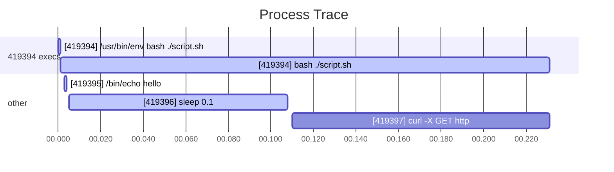

```mermaid
gantt
    title Process Trace
    dateFormat x
    axisFormat %S.%L
    todayMarker off

    section 419394 execs
    [419394] /usr/bin/env bash ./script.sh :active, 0, 1ms
    [419394] bash ./script.sh :active, 1, 230ms
    section other
    [419395] /bin/echo hello :active, 3, 1ms
    [419396] sleep 0.1 :active, 5, 103ms
    [419397] curl -X GET http://example.com :active, 110, 121ms
```
