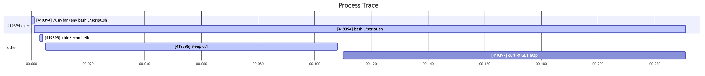

`proctrace` is a high-level profiler for process lifecycle events such as `fork`,
`exec`, `setpgid`, and `setsid`.
Future work will extend this to tracking open file descriptors,
reads, writes, etc.

Under the hood `proctrace` uses [bpftrace](https://github.com/bpftrace/bpftrace)
to trace kernel-level events and system calls.
This means that it only works on Linux _when recording_.
`proctrace` can take a recording from a Linux system and analyze it on whatever systems you
can compile Rust.

macOS support is planned but is on hold until a firmware/OS bug is fixed that
causes macOS to hang if DTrace is run in the (admittedly, incredibly uncommon) case that your
machine has gone to sleep since boot.
See [this thread](https://forums.developer.apple.com/forums/thread/735939) for
details.

## Motivation
This was created as a debugging tool for work on
[Flox](https://github.com/flox/flox).
Flox is a new developer environment tool that provides reproducible, shareable developer
environments using carefully configured subshells rather than containers.
Making this a nice experience for users requires careful orchestration of a few processes
and shell configuration.

The Flox test suite also makes extensive use of [bats](https://github.com/bats-core/bats-core),
the Bash Automated Test Suite.
As part of execution this test suite spawns a wealth of processes, and opens a file descriptor
for debug output (rather than writing to `stderr` since that could be mixed up with program output).
If you're unlucky, this extra file descriptor can get inherited by backgrounded processes,
which causes `bats` to hang indefinitely.
It also causes your CI to burn itself to the ground every now and then.

I was tired of dealing with these kinds of issues (and more), and I wasn't satisfied with our
ability to quickly debug these issues, so I wrote `proctrace` with the intention that we could
let it run in CI alongside the test suite, and export a recording on a test failure.

## Output

Output can be generated in a variety of formats, namely:
- By event timestamp
- By process in fork-order
- Mermaid Gantt chart as a poor-man's distributed-trace-looking output

Sequential output is newline-delimited JSON:
```
{"Fork":{"timestamp":777771839,"parent_pid":415779,"child_pid":415790,"parent_pgid":286785}}
{"Exec":{"timestamp":777873759,"pid":415790,"ppid":415779,"pgid":415790,"cmdline":"flox activate -- sleep 1"}}
{"Exec":{"timestamp":778236771,"pid":415790,"ppid":415779,"pgid":415790,"cmdline":"flox activate -- sleep 1"}}
{"Fork":{"timestamp":821380607,"parent_pid":415790,"child_pid":415802,"parent_pgid":415779}}
{"Exec":{"timestamp":821441901,"pid":415802,"ppid":415790,"pgid":415802,"cmdline":"/nix/store/gbg2xq3si9vf8w9pi3lywf83bs6rz74w-flox-watchdog-1.2.3/bin/flox-watchdog --pid 415790 --logs /home/zmitchell/code/proctrace/.flox/cache/watchdog.415790.log --socket /run/user/1000/flox.5ae6e2f1.sock --hash 5ae6e2f1 --registry /home/zmitchell/.local/share/flox/env-registry.json"}}
{"Exec":{"timestamp":821667200,"pid":415790,"ppid":415779,"pgid":415790,"cmdline":"/nix/store/lm10ywzflq9qfhr4fl0zqxrhiksf28ks-bash-5.2-p15/bin/bash /home/zmitchell/code/proctrace/.flox/run/aarch64-linux.proctrace/activate -c sleep 1"}}
{"Fork":{"timestamp":824291494,"parent_pid":415790,"child_pid":415803,"parent_pgid":415779}}
{"Exec":{"timestamp":824646881,"pid":415803,"ppid":415790,"pgid":415803,"cmdline":"/nix/store/zzmqcgd2vrql9656a2fkwk948r38mgai-coreutils-9.3/bin/dirname -- /home/zmitchell/code/proctrace/.flox/run/aarch64-linux.proctrace/activate"}}
{"Exit":{"timestamp":825310528,"pid":415803,"ppid":415790,"pgid":415803}}
...
```

By-process is also newline-delimited JSON (mostly out of convenience) with a header describing the process that the events come from:
```
PID 415790: flox activate -- sleep 1
{"Fork":{"timestamp":777771839,"parent_pid":415779,"child_pid":415790,"parent_pgid":286785}}
{"Exec":{"timestamp":777873759,"pid":415790,"ppid":415779,"pgid":415790,"cmdline":"flox activate -- sleep 1"}}
{"Exec":{"timestamp":778236771,"pid":415790,"ppid":415779,"pgid":415790,"cmdline":"flox activate -- sleep 1"}}
{"Exec":{"timestamp":821667200,"pid":415790,"ppid":415779,"pgid":415790,"cmdline":"/nix/store/lm10ywzflq9qfhr4fl0zqxrhiksf28ks-bash-5.2-p15/bin/bash /home/zmitchell/code/proctrace/.flox/run/aarch64-linux.proctrace/activate -c sleep 1"}}
{"Exec":{"timestamp":841641399,"pid":415790,"ppid":415779,"pgid":415790,"cmdline":"/bin/bash --noprofile --rcfile /home/zmitchell/code/proctrace/.flox/run/aarch64-linux.proctrace/activate.d/bash -c sleep 1"}}
{"Exec":{"timestamp":842538886,"pid":415790,"ppid":415779,"pgid":415790,"cmdline":"sleep 1"}}
{"Exit":{"timestamp":1844663774,"pid":415790,"ppid":415779,"pgid":415790}}

PID 415802: /nix/store/gbg2xq3si9vf8w9pi3lywf83bs6rz74w-flox-watchdog-1.2.3/bin/flox-watchdog --pid 415790 --logs /home/zmitchell/code/proctrace/.flox/cache/watchdog.415790.log --socket /run/user/1000/flox.5ae6e2f1.sock --hash 5ae6e2f1 --registry /home/zmitchell/.local/share/flox/env-registry.json
{"Fork":{"timestamp":821380607,"parent_pid":415790,"child_pid":415802,"parent_pgid":415779}}
{"Exec":{"timestamp":821441901,"pid":415802,"ppid":415790,"pgid":415802,"cmdline":"/nix/store/gbg2xq3si9vf8w9pi3lywf83bs6rz74w-flox-watchdog-1.2.3/bin/flox-watchdog --pid 415790 --logs /home/zmitchell/code/proctrace/.flox/cache/watchdog.415790.log --socket /run/user/1000/flox.5ae6e2f1.sock --hash 5ae6e2f1 --registry /home/zmitchell/.local/share/flox/env-registry.json"}}
{"Exit":{"timestamp":1856265364,"pid":415802,"ppid":1,"pgid":415802}}

PID 415803: /nix/store/zzmqcgd2vrql9656a2fkwk948r38mgai-coreutils-9.3/bin/dirname -- /home/zmitchell/code/proctrace/.flox/run/aarch64-linux.proctrace/activate
{"Fork":{"timestamp":824291494,"parent_pid":415790,"child_pid":415803,"parent_pgid":415779}}
{"Exec":{"timestamp":824646881,"pid":415803,"ppid":415790,"pgid":415803,"cmdline":"/nix/store/zzmqcgd2vrql9656a2fkwk948r38mgai-coreutils-9.3/bin/dirname -- /home/zmitchell/code/proctrace/.flox/run/aarch64-linux.proctrace/activate"}}
{"Exit":{"timestamp":825310528,"pid":415803,"ppid":415790,"pgid":415803}}

...
```

Here is an example of the Mermaid output (you may need to open in a new tab to see it better):


This output mode is arguably the most useful, but also the least ergonomic at the moment.
Currently `proctrace` will write the Gantt chart syntax to the specified output and you can either
copy and paste that yourself in the Mermaid Live Editor or generate diagrams yourself via the Mermaid
CLI (note that this...requires installing headless Chromium or something, I just use the live editor).

Eventually I would like to replace the Mermaid output with HTML reports similar to
[cargo build timings](https://doc.rust-lang.org/cargo/reference/timings.html)
so that we have more control over the legibility of the output.
